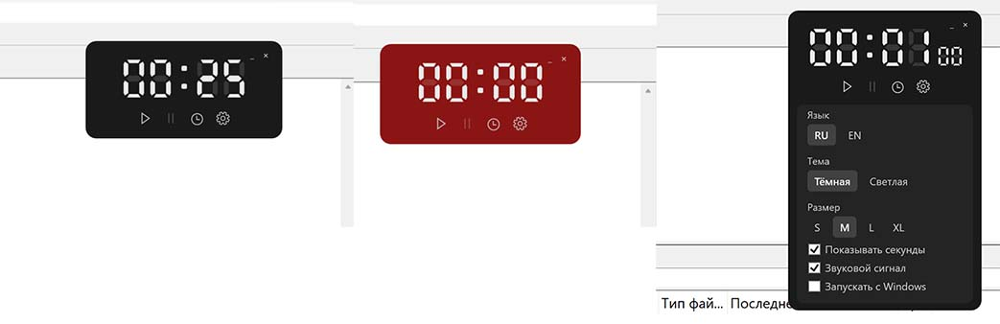

# Timer Widget

[Русская версия](README.md)

A compact count-down and count-up timer for Windows with a seven-segment LCD-style display. The widget stays on top of other windows and can be placed anywhere on the screen without getting in your way.

Supports Windows 10 and 11. Current version: 0.1.

## Screenshots



## Installation

Download `TimerWidget-Setup.exe` from the latest release and run it. The installer lets you choose the interface language and optionally create a desktop shortcut or start Timer Widget with Windows.

Administrator privileges are not required: the application is installed for the current user. The installer includes everything needed to run the app, so a separate .NET installation is not required.

The installer is not code-signed. Windows SmartScreen may therefore display a warning; select **More info**, then **Run anyway**.

Uninstalling Timer Widget removes the application files, its startup entry, and its saved settings.

## Using Timer Widget

When launched, the timer appears in the upper-right corner of the screen. Drag it to any convenient location.

Four buttons are displayed below the timer:

- **Start** begins the timer from the start. Pressing it while the timer is already running restarts the current count.
- **Pause** pauses the timer. Press it again to resume.
- **Clock** opens the mode and interval controls.
- **Settings** opens the application settings.

There is no separate reset button: **Start** also serves as reset and restart.

## Count-down and Count-up Modes

The timer supports two modes, selected from the Clock panel. The alert interval is configured in hours and minutes in the same panel.

Values can be entered with the keyboard, adjusted with the arrow buttons, or changed by scrolling the mouse wheel over a field. The wheel changes the value by one; hold **Shift** to change it by five. The minimum step is one minute, and the maximum interval is 23 hours 59 minutes.

Changing the interval while the timer is running does not interrupt the current run. The new value is used the next time **Start** is pressed. In count-down mode, changing the interval while idle updates the display immediately.

### Count-down

Counts from the configured interval down to zero.

### Count-up

Counts upward from zero and triggers the alert when it reaches the configured interval. An interval of `0:00` turns this mode into a stopwatch without an alert; it stops automatically at the display limit of `23:59:59`.

Switching modes does not discard the configured interval.

## Alerts

When the target time is reached, the widget flashes red three times and then remains red until you click anywhere on it or start the timer again. This makes the alert difficult to miss.

In the dark theme, the background turns red while the digits remain light. In the light theme, the digits turn red instead.

If sound is enabled, the visual alert is accompanied by three quiet beeps. The sound stops when the alert is dismissed or the timer is started again. If no audio device is available, the timer continues working without sound.

Alerts are triggered when a count-down reaches zero and when a count-up reaches its configured interval. A count-up running with a `0:00` interval stops silently at `23:59:59`.

## Settings

| Setting | Options | Default |
|---|---|---|
| Language | Russian or English | Windows display language |
| Theme | Dark or light | Dark |
| Size | S, M, L, or XL | M |
| Seconds | Show or hide | Hidden |
| Sound | Enabled or disabled | Disabled |
| Start with Windows | Enabled or disabled | Disabled |

On first launch, the interface follows the Windows display language: Russian systems use Russian, while all other systems use English. Once selected manually, the language is remembered and no longer follows the system setting.

The size presets scale the entire widget: S is 75% of the standard size, M is the standard size, and L and XL are approximately one-third and two-thirds larger.

When enabled, seconds appear to the right of the minutes in smaller digits. When seconds are hidden, an incomplete minute remains visible for its full duration during count-down—for example, `01:00` remains displayed until the final minute actually begins. The colon between hours and minutes flashes once per second while the timer is running, providing a clear activity indicator.

## Settings Storage

Settings and window placement are stored in:

```text
%AppData%\TimerWidget\settings.json
```

Example:

```json
{
  "theme": "dark",
  "language": "",
  "sizeId": "M",
  "showSeconds": false,
  "soundEnabled": false,
  "autostart": false,
  "mode": "countDown",
  "durationSec": 1500,
  "placement": {
    "monitorDeviceName": "\\\\.\\DISPLAY1",
    "nx": 0.82,
    "ny": 0.12
  }
}
```

The widget position is stored as a monitor identifier and normalized coordinates rather than raw pixels. This keeps it on-screen when the display resolution or UI scaling changes. If the saved monitor is disconnected, the widget is moved to the primary display.

The active timer state is intentionally not persisted. After an application restart, the timer waits for **Start** while retaining the selected mode and interval.

The **Start with Windows** option uses:

```text
HKCU\Software\Microsoft\Windows\CurrentVersion\Run
```

The application setting and installer option manage the same registry entry.

## Limitations

Timer Widget cannot appear above games using exclusive full-screen mode due to a Windows limitation. It works normally with borderless-windowed games.

The current version does not provide global hotkeys, multiple simultaneous timers, or click-through mode. Only 64-bit Windows is supported.

## Building from Source

Requirements:

- Windows
- [.NET 8 SDK](https://dotnet.microsoft.com/download/dotnet/8.0)

Run from the application directory:

```powershell
dotnet build -c Release
```

The framework-dependent executable is written to:

```text
bin\Release\net8.0-windows\TimerWidget.exe
```

This build requires .NET 8 to be installed and is not intended for distribution.

### Building the Installer

The installer must be created from a self-contained publication, which includes the .NET runtime. [Inno Setup 6](https://jrsoftware.org/isinfo.php) is also required.

```powershell
Get-Process TimerWidget -ErrorAction SilentlyContinue | Stop-Process -Force
dotnet publish -c Release -r win-x64 --self-contained true -o .\installer\publish
& "${env:ProgramFiles(x86)}\Inno Setup 6\ISCC.exe" .\installer\TimerWidget.iss
```

The resulting installer is written to:

```text
InstallerOutput\TimerWidget-Setup.exe
```

The Inno Setup script packages files from `installer\publish`.

## Project Structure

Timer Widget is a small WPF application targeting .NET 8. It deliberately avoids a separate MVVM layer: `AppSettings` stores configuration, `TimerEngine` tracks time, and the main window and two panels interact with them directly.

```text
app/
  MainWindow.xaml          widget layout, controls, and panel hosts
  Views/
    ClockPanel             timer mode and interval controls
    SettingsPanel          appearance and system settings
  Controls/
    SevenSegmentDigit      a single seven-segment digit
    SevenSegmentDisplay    the complete timer display
  Services/
    TimerEngine            timing logic
    SettingsStore          settings persistence
    WindowPlacement        screen position management
    AutostartService       Windows startup registry entry
    TrayService            notification-area icon
    SoundService           audible alert
    Loc                    Russian and English resources
    SingleInstance         prevents multiple app instances
    ThemeService           theme switching
  Native/WindowChrome      always-on-top, dragging, and focus behavior
  Resources/               localized interface strings
  installer/               Inno Setup script
```

Digits are rendered as vector shapes rather than a font. This allows the display to show inactive segments and more closely resemble a physical LCD.

Elapsed time is measured with `Stopwatch`; the UI timer only refreshes the display five times per second. Timing therefore remains accurate even if the system briefly stalls or resumes from sleep.

## License

[MIT](LICENSE) © 2026 Evgenii Petrashchuk.
